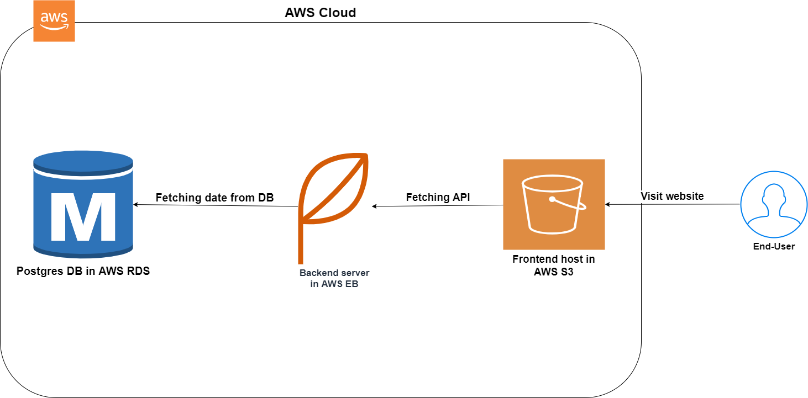

# Infrastructure description

1. AWS RDS Postgres
    Its a relational database service provided by AWS that provides a fully managed, secure, and reliable database.
    so i choose it to run my database and to serve the backend(server).
2. AWS Elastic Beanstalk
    Its an AWS web service that allow to deploy applications on AWS with preconfigured environments.
    son i choose it to run my backend services and i deployed my application on it\
    [Udagram-Backend](udagram-api-env.eba-kmksr9hy.us-east-1.elasticbeanstalk.com)
3. AWS S3
    Its an object storage service offering industry-leading scalability, data availability, security, and performance. Customers of all sizes and industries can store and protect any amount of data for virtually any use case, such as data lakes, cloud-native applications, and mobile apps.
    so i choose it to host my frontend
    [Udagram-Frontend](http://udagram-frontend-s3.s3-website-us-east-1.amazonaws.com)

## Infrastructure digram

