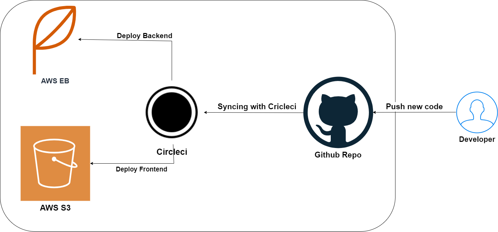

# Pipeline process

## Circleci
    CircleCI is the software delivery engine for teams who want to ship software faster and with confidence.
### Circleci pipeline
1. Commit code to Github Repo
2. Clone the Repo to cricleci environment
3. build the project
    cricleci build my project and creates docker image in the following sequence:
    1. install frontend dependencies (npm run frontend:install)
    2. install backend dependencies (npm run api:install)
    3. linting the frontend (npm run frontend:lint)
    4. build frontend (npm run frontend:build)
    5. build backend (npm run api:build)
4. deploy the projcet
    circleci deploys the frontend and backend to AWS S3 and AWS elastic beanstalk in the following sequence:
    1. setup elastic beanstalk and aws cli
    2. deploy frontend (npm run frontend:deploy)
    3. deploy backend (npm run api:deploy)

